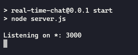

# Chat Realtime
Esse é um projeto bem simples, feito para aprender um pouco sobre como usar WebSocket


___

## Como usar

Requisitos:
- NodeJS

Na pasta do projeto, digite o comando abaixo pra instalar as dependências
```
npm install
```

Após a instalação, digite:
```
npm start
```


A seguinte imagem deve ser exibida no console



Após isso, é só acessar o [localhost](http://localhost:3000) pelo navegador